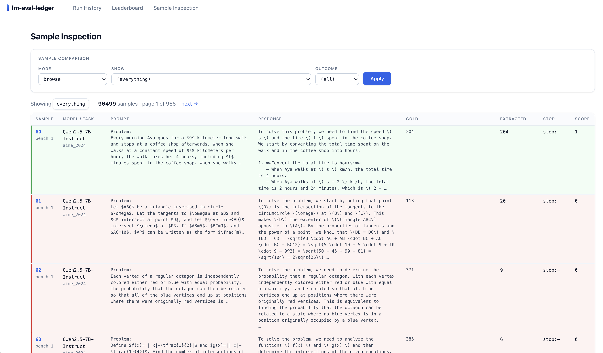
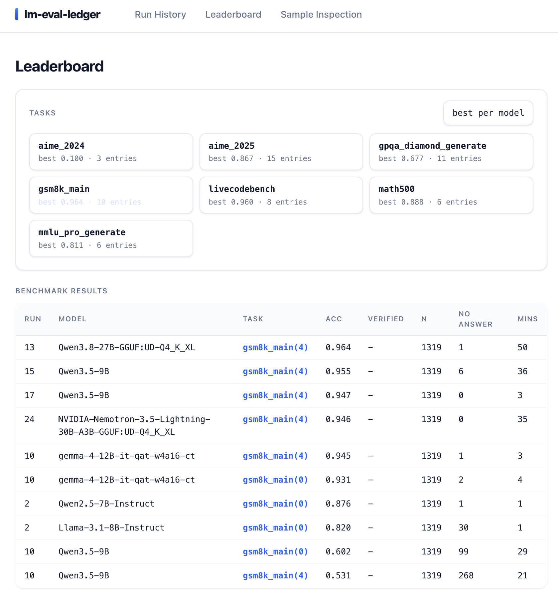
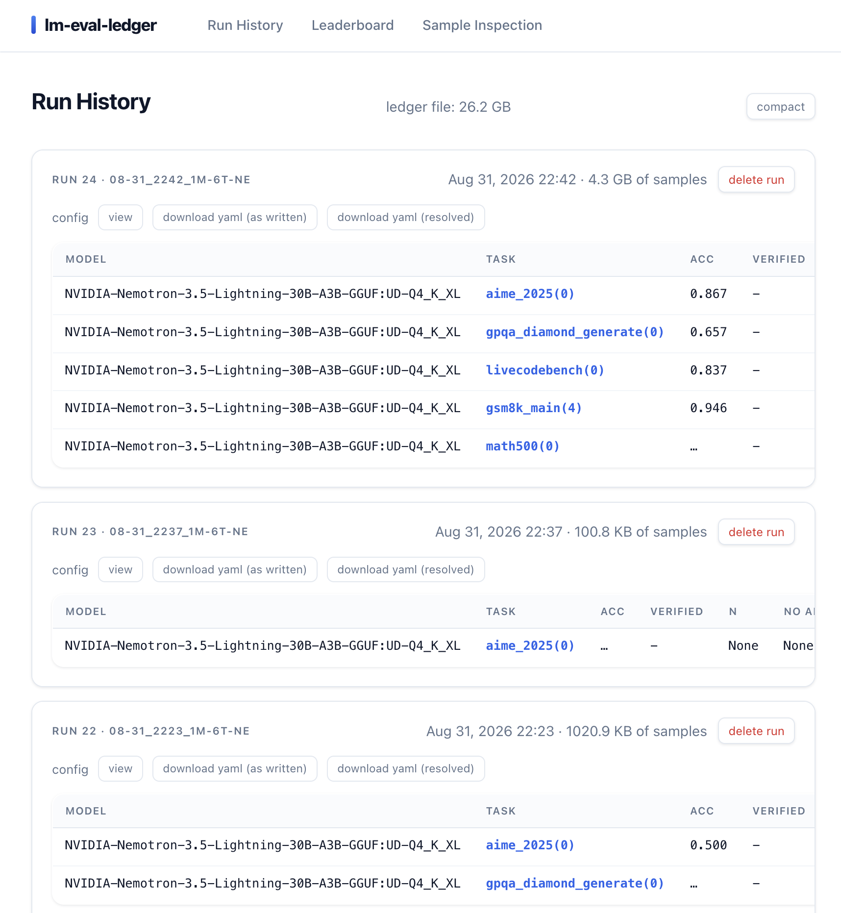

# lm-eval-ledger
**lm-eval-ledger** is an LLM evaluation harness with a built-in web app for browsing and comparing what models generate. Every generation is logged to SQLite in real time, so you can read the prompt, response, extracted answer, and score for any sample while the run is still going. Models and tasks are defined in one YAML file: benchmark many models × many tasks in a single run.


Live demo: [lm-eval-ledger on Hugging Face Spaces](https://huggingface.co/spaces/...)


**Features**

- **One YAML, many runs** — benchmark any number of models × tasks in a single command
- **Per-sample SQLite logging** — prompt, response, gold, extracted answer, stop reason, and score, written as each sample finishes
- **Web app** — browse, compare, and delete runs and samples, even mid-benchmark
- **Backends** — vLLM, SGLang, HF transformers, or any OpenAI-compatible server (e.g. llama.cpp)
- **Interactive config** — unset configs like thinking mode are detected from the model and offered as a menu
- **Custom tasks** — add your own tasks and get the same per-sample logging and inspection.

<p align="center">
  
</p>

**Sample Inspection** — every prompt, response, extracted answer, and score, color-coded by outcome. Filter by model, task, or right/wrong, and compare how different models answered the same question.

<table>
  <tr>
    <td width="50%" valign="top">
      <br>
      <b>Leaderboard</b> — pick a task and see every model ranked by accuracy, across all runs. One click to keep only the best per model.
    </td>
    <td width="50%" valign="top">
      <br>
      <b>Run History</b> — browse all runs, check accuracy per model and task, grab the exact YAML that produced them, or delete a whole run or a single benchmark.
    </td>
  </tr>
</table>

## Install

```bash
pip install lm-eval-ledger
```

Inference backends are optional extras — install the one you will use:

```bash
pip install "lm-eval-ledger[vllm]"     # vLLM
pip install "lm-eval-ledger[sglang]"   # SGLang
pip install "lm-eval-ledger[hf]"       # HF transformers
```

## Quickstart

```bash
lm-eval-ledger init                                 # write template.yaml, create results/ and logs/
lm-eval-ledger -c config.yaml                       # run benchmarks
lm-eval-ledger serve --db results/ledger.sqlite3    # browse at http://localhost:8090
```

See [Configuration](#configuration) for the YAML format and [TASKS.md](TASKS.md) for available tasks.

## Configuration

A minimal config:

```yaml
backend: vllm
models:
  - name: Qwen/Qwen3-8B
tasks: [gsm8k_main, math500]
```

Every option, with defaults and per-backend settings, is documented in [`template.yaml`](template.yaml) (the same file `lm-eval-ledger init` writes). Copy it and uncomment what you need.

## Backends

One config format, four engines:

| backend  | install                              | OS             |
|----------|--------------------------------------|----------------|
| `vllm`   | `pip install "lm-eval-ledger[vllm]"`   | Linux          |
| `sglang` | `pip install "lm-eval-ledger[sglang]"` | Linux          |
| `hf`     | `pip install "lm-eval-ledger[hf]"`     | Linux, Windows |
| `server` | `pip install lm-eval-ledger` *(no extra)* | Linux, Windows |

### Example: llama.cpp

Start a llama.cpp server:

```bash
llama-server -hf unsloth/Qwen3-30B-GGUF:Q4_K_XL -ngl 999 -c 65536 -np 4 --jinja
```

Point the config at it:

```yaml
backend: server
server_url: http://localhost:8080/v1
server_concurrency: 4        # match the server's -np slots
```

Any OpenAI-compatible endpoint works the same way.

## Thinking mode

Set `chat_template_kwargs` per model to control thinking. If it is left unset, the harness reads the model's chat template (from the HF cache, or a llama.cpp server's `/props`), detects the available knobs, offers a menu, and prints the YAML to make the choice permanent. Set `chat_template_kwargs: {}` to skip the prompt and use the template defaults.

```yaml
models:
  - name: Qwen/Qwen3-8B
    chat_template_kwargs: {enable_thinking: true, reasoning_effort: high}
  - google/gemma-3-12b-it        # no thinking knob; global settings apply
```